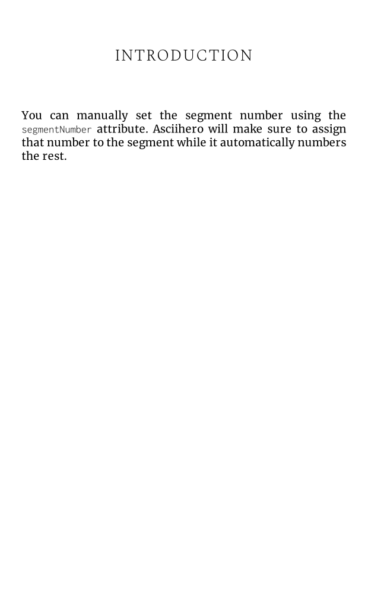
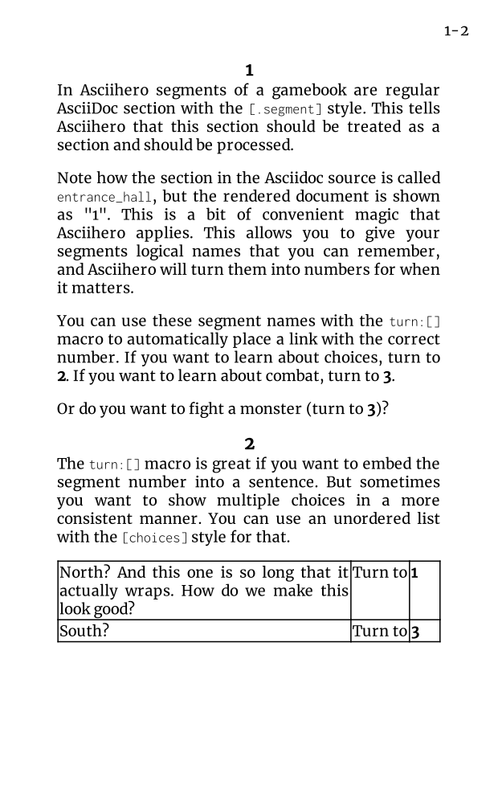
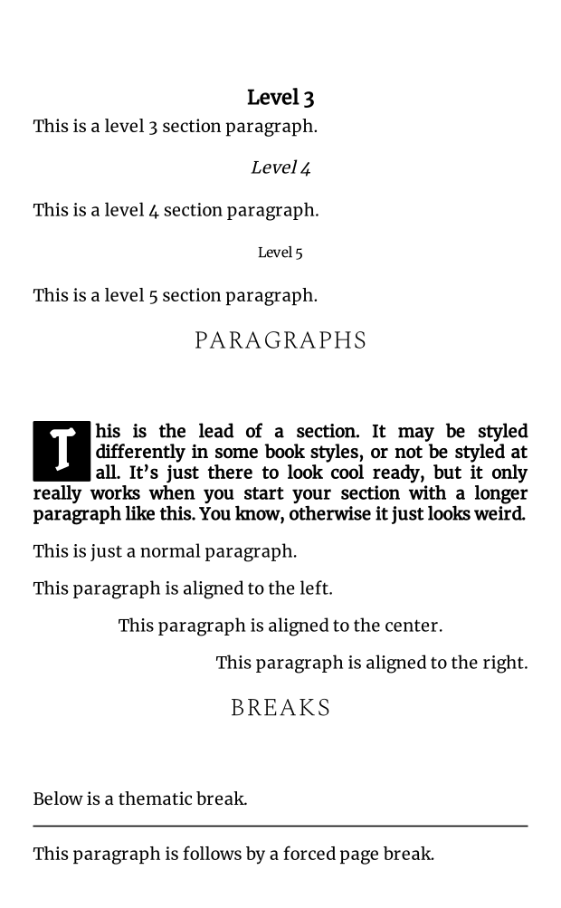

# AsciiHero

[](https://github.com/mrombout/asciihero/actions/workflows/ci.yml)
[](https://mrombout.github.io/asciihero/)
[](https://github.com/mrombout/asciihero/releases)

A converter for AsciiDoc to author Fighting Fantasy style gamebooks in PDF.
It uses [asciidoctor-web-pdf](https://github.com/ggrossetie/asciidoctor-web-pdf) under the hood to convert and product a PDF.

# Getting started

To convert an AsciiDoc document run the following command in your terminal:

```console
asciihero document.adoc
```

For more thorough documentation, see the [documentation](https://mrombout.github.io/asciihero).

# Examples

<table width="100%">
    <tr align="center">
        <td width="25%">
            <a href="./examples/attributes/attributes.pdf">
                
            </a>
        </td>
        <td width="25%">
            <a href="./examples/dice_footer/dice_footer.pdf">
                
            </a>
        </td>
        <td width="25%">
            <a href="./examples/dice_table/dice_table.pdf">
                
            </a>
        </td>
        <td width="25%">
            <a href="./examples/images/images.pdf">
                
            </a>
        </td>
    </tr>
    <tr align="center">
        <td width="25%">
            Attributes<br />
            <a href="./examples/attributes/attributes.adoc"> Source </a> / 
            <a href="./examples/attributes/attributes.pdf"> PDF </a>
        </td>
        <td width="25%">
            Dice Footer<br />
            <a href="./examples/dice_footer/dice_footer.adoc"> Source </a> / 
            <a href="./examples/dice_footer/dice_footer.pdf"> PDF </a>
        </td>
        <td width="25%">
            Dice Table<br />
            <a href="./examples/dice_table/dice_table.adoc"> Source </a> / 
            <a href="./examples/dice_table/dice_table.pdf"> PDF </a>
        </td>
        <td width="25%">
            Images<br />
            <a href="./examples/images/images.adoc"> Source </a> / 
            <a href="./examples/images/images.pdf"> PDF </a>
        </td>
    </tr>
</table>

<table width="100%">
    <tr align="center">
        <td width="25%">
            <a href="./examples/input/input.pdf">
                
            </a>
        </td>
        <td width="25%">
            <a href="./examples/manual_segment_number/manual_segment_number.pdf">
                
            </a>
        </td>
        <td width="25%">
            <a href="./examples/shuffle/shuffle.pdf">
                
            </a>
        </td>
        <td width="25%">
            <a href="./examples/simple/simple.pdf">
                
            </a>
        </td>
    </tr>
    <tr align="center">
        <td width="25%">
            Input<br />
            <a href="./examples/input/input.adoc"> Source </a> / 
            <a href="./examples/input/input.pdf"> PDF </a>
        </td>
        <td width="25%">
            Manual Segment Number<br />
            <a href="./examples/manual_segment_number/manual_segment_number.adoc"> Source </a> / 
            <a href="./examples/manual_segment_number/manual_segment_number.pdf"> PDF </a>
        </td>
        <td width="25%">
            Shuffle<br />
            <a href="./examples/shuffle/shuffle.adoc"> Source </a> / 
            <a href="./examples/shuffle/shuffle.pdf"> PDF </a>
        </td>
        <td width="25%">
            Simple<br />
            <a href="./examples/simple/simple.adoc"> Source </a> / 
            <a href="./examples/simple/simple.pdf"> PDF </a>
        </td>
    </tr>
</table>

<table width="100%">
    <tr align="center">
        <td width="25%">
            <a href="./examples/stable_segments/stable_segments.pdf">
                
            </a>
        </td>
        <td width="25%">
            <a href="./examples/stylesheet/stylesheet.pdf">
                
            </a>
        </td>
        <td width="25%"></td>
        <td width="25%"></td>
    </tr>
    <tr align="center">
        <td width="25%">
            Stable Segments<br />
            <a href="./examples/stable_segments/stable_segments.adoc"> Source </a> / 
            <a href="./examples/stable_segments/stable_segments.pdf"> PDF </a>
        </td>
        <td width="25%">
            Stylesheet<br />
            <a href="./examples/stylesheet/stylesheet.adoc"> Source </a> / 
            <a href="./examples/stylesheet/stylesheet.pdf"> PDF </a>
        </td>
        <td width="25%"></td>
        <td width="25%"></td>
    </tr>
</table>