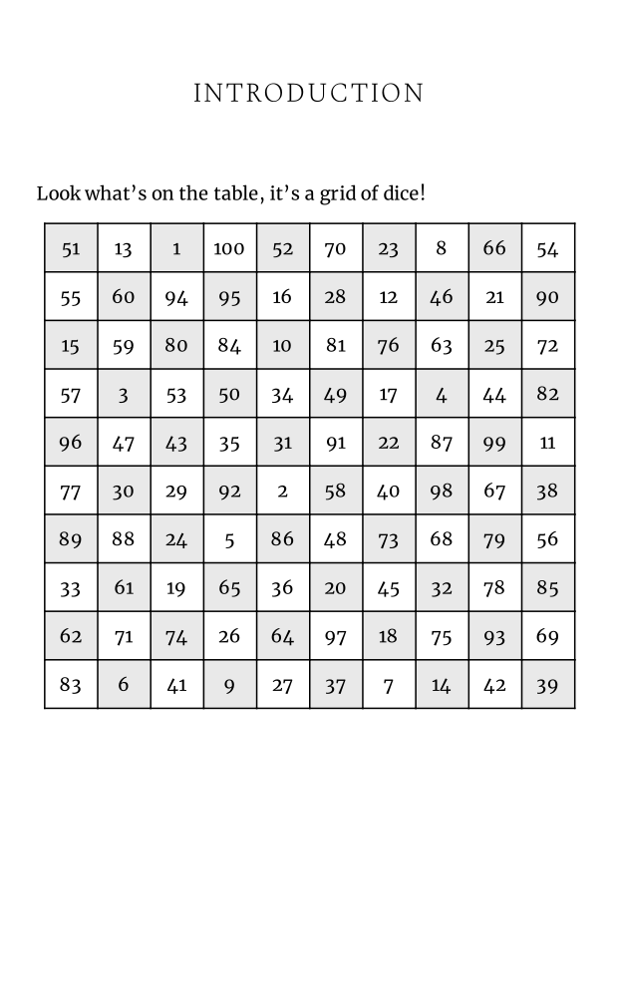
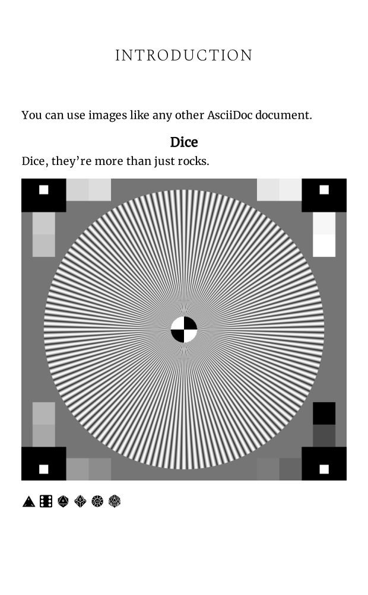
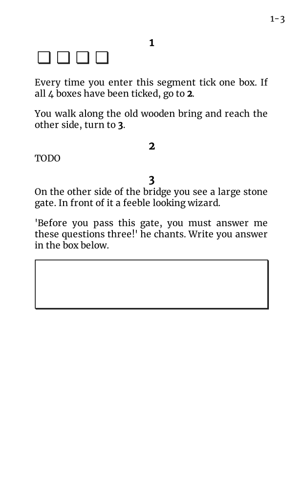

# AsciiHero

[](https://github.com/mrombout/asciihero/actions/workflows/ci.yml)
[](https://mrombout.github.io/asciihero/)
[](https://github.com/mrombout/asciihero/releases)

A converter for AsciiDoc to author Fighting Fantasy style gamebooks in PDF.
It uses [asciidoctor-web-pdf](https://github.com/ggrossetie/asciidoctor-web-pdf) under the hood to convert and product a PDF.

# Getting started

To convert an AsciiDoc document run the following command in your terminal:

```console
asciihero document.adoc
```

For more thorough documentation, see the [documentation](https://mrombout.github.io/asciihero).

## Examples

<table>
    <tr>
        <td width="25">
            <a href="">
                
            </a>
        </td>
        <td width="25">
            <a href="">
                
            </a>
        </td>
        <td width="25">
            <a href="">
                
            </a>
        </td>
        <td width="25">
            <a href="">
                
            </a>
        </td>
    </tr>
    <tr>
        <td width="25">
            Attributes<br />
            <a href="#"> source </a> / 
            <a href="#"> PDF </a>
        </td>
        <td width="25">
            Dice Footer<br />
            <a href="#"> source </a> / 
            <a href="#"> PDF </a>
        </td>
        <td width="25">
            Dice Table<br />
            <a href="#"> source </a> / 
            <a href="#"> PDF </a>
        </td>
        <td width="25">
            Images<br />
            <a href="#"> source </a> / 
            <a href="#"> PDF </a>
        </td>
    </tr>
</table>

<table>
    <tr>
        <td width="25">
            <a href="">
                
            </a>
        </td>
        <td width="25">
            <a href="">
                
            </a>
        </td>
        <td width="25">
            <a href="">
                
            </a>
        </td>
        <td width="25">
            <a href="">
                
            </a>
        </td>
    </tr>
    <tr>
        <td width="25">
            Input<br />
            <a href="#"> source </a> / 
            <a href="#"> PDF </a>
        </td>
        <td width="25">
            Manual Segment Number<br />
            <a href="#"> source </a> / 
            <a href="#"> PDF </a>
        </td>
        <td width="25">
            Shuffle<br />
            <a href="#"> source </a> / 
            <a href="#"> PDF </a>
        </td>
        <td width="25">
            Simple<br />
            <a href="#"> source </a> / 
            <a href="#"> PDF </a>
        </td>
    </tr>
</table>

<table>
    <tr>
        <td width="25">
            <a href="">
                
            </a>
        </td>
        <td width="25">
            <a href="">
                
            </a>
        </td>
        <td width="25"></td>
        <td width="25"></td>
    </tr>
    <tr>
        <td width="25">
            Stable Segments<br />
            <a href="#"> source </a> / 
            <a href="#"> PDF </a>
        </td>
        <td width="25">
            Stylesheet<br />
            <a href="#"> source </a> / 
            <a href="#"> PDF </a>
        </td>
        <td width="25"></td>
        <td width="25"></td>
    </tr>
</table>